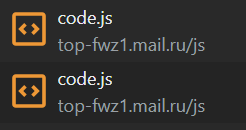
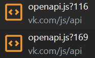
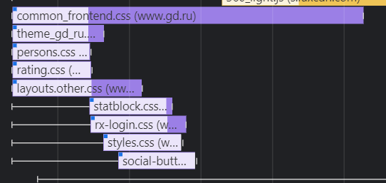

# Дублирование ресурсов:

 <br />
 <br />
 <br />
 <br />
 <br />

<hr />

# Лишний размер ресурса:
   - jQuery-3.5.1.js (не минифицирован) <br />
    <br />
   - lite.js (не минифицирован) <br />
    <br />
   - layouts.other.css (не минифицирован) <br />
    <br />
   - openapi.js (не минифицирован) <br />
    <br />

<hr />

# Медленно загружающиеся ресурсы:
   - base.js <br />
    <br />
   - ```https://banners.adfox.ru/230329/adfox/2322229/6395382.917ae9f4f6f638eb8db4f3398775523a.gif``` <br />
    <br />
   - sdk.js <br />
    <br />

<hr />

# Ресурсы, блокирующие загрузку:
   - стили, необходимые для отрисовки <br />
    <br />
   - некоторые JS файлы (напр. context.js, sdk.js и 360_light.js) <br />
    <br />