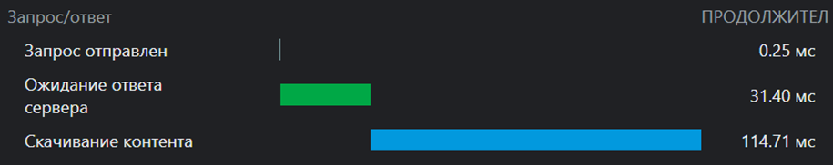

#Дублирование ресурсов:
   - code.js
     
   - collect
     
   - fontawesome
     
   - main.js
     
   - openapi.js
     
   - Рамблер изображение
     

#Лишний размер ресурса:
   - jQuery-3.5.1.js (не минифицирован)
     
   - lite.js (не минифицирован)
     
   - opeanapi.js (не минифицирован)
     
   - layouts.other.css (не минифицирован)
     

#Медленно загружающиеся ресурсы:
   - 9039-finansovyy-kontrol
     
   - bootstrap.min.js
     
   - loader_nav.js
     
   - community.js
     

#Ресурсы, блокирующие загрузку:
   - стили, необходимые для отрисовки
     
   - некоторые JS файлы (напр. context.js и sdk.js)
     
